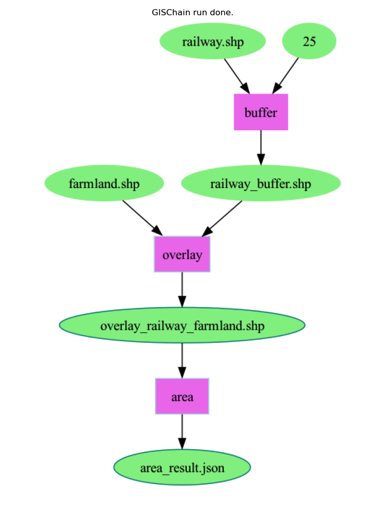
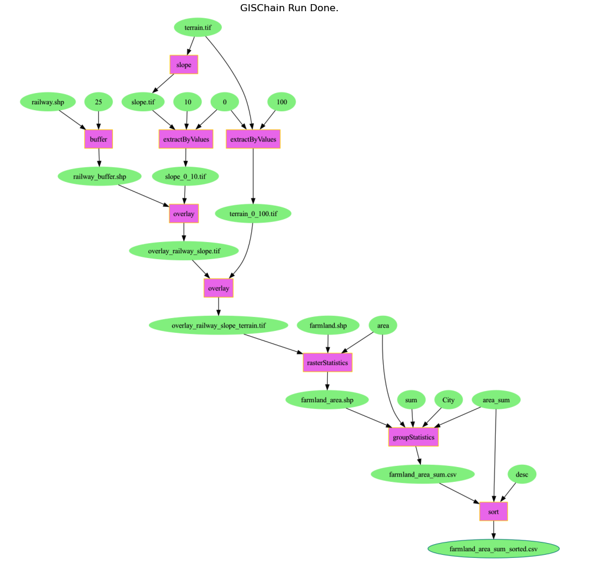
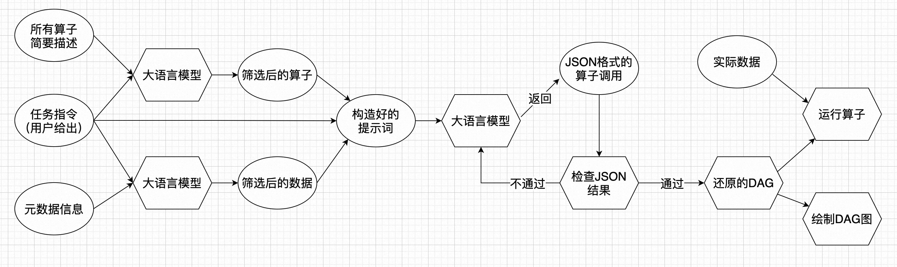

# gischain

## 简介
gischain是利用大语言模型的能力，用户只需要发出一条需要完成的任务的指令，gischain就可以自动执行相应的gis工具，并返回结果。  
具体可参见 example.py 中的例子，注意请把key更换为自己的。
里面包括两条用户指令，执行后的DAG分别如下：
### 简单例子

### 复杂例子

## 技术原理
gischain内部实现的技术原理图
步骤如下：
1. gischain预先定义把可能用到的gis工具，用json格式描述功能
2. 用户给出需要完成任务的指令
3. gischain通过构造好的提示词，把gis工具的描述信息和任务指令，一起发给大语言模型
4. 大语言模型按照规定的格式返回需要调用的工具列表及其运行参数
5. gischain解析大语言模型的返回结果，并逐一执行工具

## 大语言模型支持情况
当前支持的大语言模型包括：
1. chatglm 智谱AI
2. qwen-turbo 通义千问
3. ErnieBot4 文心一言 v4.0
4. gpt3.5和gpt4 大家都知道的
5. text2sql 内部是通过codellama微调得到

目前除了gpt4表现的最好，能支持较为复杂的指令（七个步骤）做出编排，其它都只能支持简单的指令（三个步骤）。

## 部署 & 运行
### 用conda创建新环境，再调用
1. conda env create -f environment.yml
2. conda activate gischain
3. python example.py

### 用pip安装相应的库，再调用
1. 确认python版本为3.11.4或以上。可用conda新创建环境，命令：conda create -n youenv python=3.11.4
2. pip install -r requirements.txt
3. python example.py

## TODO LIST
1. 目前和部分在线的大语言模型做了适配，后续会考虑本地部署的大语言模型
2. 目前只提供了少量gis工具作为例子，需要的话请自行实现更多工具，包括非空间算子工具
3. 目前严重依赖于大语言模型本身的推理能力，后续考虑通过提示词工程，如ReACT等机制来完成更复杂的工具编排调用
4. 通过向量匹配或微调等方式，支持工具数量众多的情况（避免token超量）

## Q&A
Q，为什么不直接用langchain？  
A：做了尝试，发现在未使用ChatGPT的情况下，经常出现格式解析错误的情况，且很难定位修复，还不如参考langchain的思路自行实现。

Q，gdal 用 pip install gdal安装失败怎么办？  
A：换用 conda install gdal 可能就好了。

Q，提示openai没有ChatComletion属性，怎么办？  
A：这是因为openai的版本过低，需要升级到至少0.28.1。先 pip uninstall openai ,再 pip install openai即可。

## 版本说明
### 0.1.0
1. 对大模型返回的json工具调用进行检查，并把检查出来的错误结果返回给大模型，让其重新生成
2. 增加filter工具，可根据属性进行数据过滤
3. 增加config.ini文件，存放各大语言模型API调用的Key，请自行获取并替换
4. 增加test目录，纳入几个测试相关的文件
5. DAG图可绘制中文

### v0.0.9
1. 合并若干算子，方便大语言模型混淆用途类似的算子
2. 增加算子使用的举例，并输入给大语言模型，方便大语言模型理解算子的用途
3. 每个算子的描述和例子，进行向量化，并用json文件存储到tools目录下
4. 对用户提供的任务指令进行向量化，再检索采用相似度比较高的算子，避免token超量
5. 增加两个通用范例，尝试采用ReACT等机制提高大语言模型的表现，但效果不理想
6. 大语言模型区分GPT 3.5和GPT 4，GPT 4的提示词可以非常简单就能达到目的
7. 增加DAG图的美观性，数据节点只显示文件名，不显示路径

### v0.0.8
1. DAG图上的任务节点，可随着对应任务的执行结束动态改变颜色
2. 解决不能重复绘制同名tool的问题

### v0.0.7
1. 增加text2sql(内部为codellama)作为大语言模型
2. 文心一言（ErnieBot4）升级为4.0版本
3. 调整目录结构，把框架代码放到gischain目录下，把图片文档等放到doc目录下

### v0.0.6
1. 增加文心一言（ErnieBot）作为大语言模型

### v0.0.5
1. 内部执行工具时，采用多进程并行方式，提高运行效率
2. 修改文件存储目录：中间结果文件存储到temp目录下，最终结果文件存储到output目录下

### v0.0.4
1. chain.run增加show参数，可控制显示工具编排后的DAG流程图

### v0.0.3
1. 增加对gpt4的支持
2. 增加栅格相关的空间算子
3. data目录下增加对应的栅格地形数据文件
4. 在gpt4的加持下，支持更加复杂的空间分析任务指令

### v0.0.2
1. 增加对通义千问的支持
2. 内部增加llm类，方便后续增加对更多大语言模型的支持
3. 基于各大语言模型对提示词输入的要求各不相同，把提示词的构造放到大语言模型之内

### v0.0.1
1. 走通基本逻辑，实现三个工具，以及三个简单步骤能完成的gis分析任务
2. 支持在线chatglm作为大语言模型